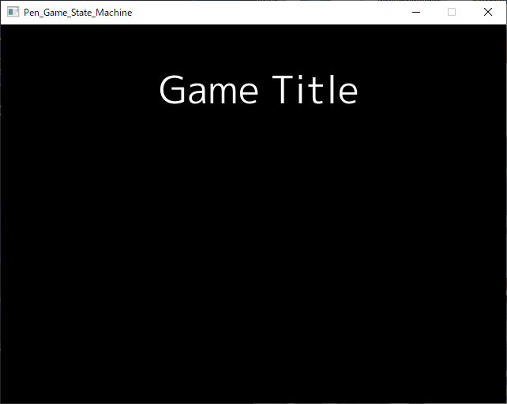
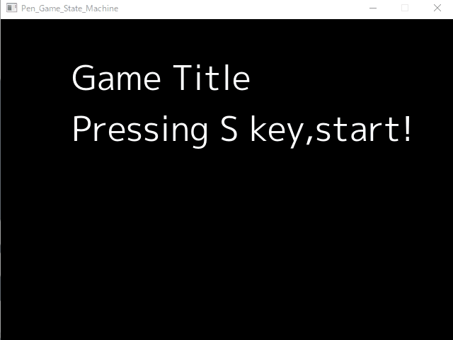

# チュートリアル
このチュートリアルでは、The Pen Game Programing Finite State Machineの使い方を学んでいきます  

# 開発環境

```shell
>go version
go version go1.17.5 windows/amd64
```

# はじめに
このライブラリは[JRPGの作り方：ゲーム開発者向けの手引き](https://gamedevelopment.tutsplus.com/ja/articles/how-to-build-a-jrpg-a-primer-for-game-developers--gamedev-6676)に影響を受けています  
ゲームステートについてわかりやすく書かれていて、このチュートリアルを読む前に、これを読んで大まかな考え方を理解することをおすすめします

# プロジェクトページの作成
まず、それがなければ話になりません  
作り方は一般的なGoのものと同じです。

```shell
mkdir tutorial
cd tutorial
go mod init tutorial
```

# ライブラリのインストール

Ebitenは依存関係になっているため、The Pen Game Programing Finite State Machineを入れるとEbitenも一緒にダウンロードされます。
```shell
go get github.com/PenguinCabinet/pgfsm
```

このチュートリアルでは文字表示も使うため、フォント関連のライブラリも入れておきます。
```shell
go get golang.org/x/image/font
go get golang.org/x/image/font/opentype
```

# タイトル画面の作成

まずタイトル画面を作ってみましょう。  
タイトル画面やゲーム画面などはステートとして作成します。  

```go
package main

import (
	"image/color"
	"log"

	"github.com/PenguinCabinet/pgfsm"
	"github.com/hajimehoshi/ebiten"
	"github.com/hajimehoshi/ebiten/examples/resources/fonts"
	"github.com/hajimehoshi/ebiten/text"
	"golang.org/x/image/font"
	"golang.org/x/image/font/opentype"
)

//これがタイトル画面のステート
type Title_Game_State_t struct {
	mplusNormalFont font.Face
}

//これがステートが最初に実行されたときに呼び出される関数
func (sm *Title_Game_State_t) Init(
	stack_deep int, /*ここにはこのステートがスタックのどの位置に積まれているかインデックスが入っています*/
	delta float64, /*ここには前のフレームと今のフレーム間で経過した時間が入っています*/
) {

	/*ここから Ebitenのフォントの初期化処理*/
	const dpi = 72

	tt, err := opentype.Parse(fonts.MPlus1pRegular_ttf)

	if err != nil {
		panic(err)
	}

	sm.mplusNormalFont, err = opentype.NewFace(tt, &opentype.FaceOptions{
		Size:    48,
		DPI:     dpi,
		Hinting: font.HintingFull,
	})

	if err != nil {
		panic(err)
	}
	/*ここまで Ebitenのフォントの初期化処理*/
}

//これはマイフレーム呼び出される関数です
//このステートが実行されている時のみ、呼び出されます
func (sm *Title_Game_State_t) Update(
	screen *ebiten.Image, /*ebitenのscreenですが、Updateで描写するのは非推奨です*/
	stack_deep int, delta float64,
) pgfsm.Result {
	/*空のpgfsm.Resultを返却することでループを継続します
	pgfsm.Resultを書き換えることで、実行するものを新しいステートに変えたり
	新しいステートをスタックの上に乗せたりすることができます*/
	return pgfsm.Result{}
}

//これはマイフレーム呼び出される描写用の関数です
//このステートが実行されていなくても、スタック上にあれば呼び出されます
func (sm *Title_Game_State_t) Draw(screen *ebiten.Image, stack_deep int, delta float64) {
	text.Draw(screen, "Game Title", sm.mplusNormalFont, 200, 100, color.White)
}

func main() {

	ebiten.SetWindowSize(640, 480)
	ebiten.SetWindowTitle("Pen_Game_State_Machine")

	gms := new(pgfsm.Machine)

	gms.LayoutWidth = 640
	gms.LayoutHeight = 480

	Title_sm := new(Title_Game_State_t)

	/*スタックにタイトル画面のステートを追加します*/
	gms.StateAdd(Title_sm)

	if err := ebiten.RunGame(gms); err != nil {
		log.Fatal(err)
	}
}
```
実行結果  


ソースコードにコメントを記述しておきました。  
ステートはpgfsm.Stateというinterfaceで仕様が決まっていて、それに基づいて実装します。  
今回はTitle_Game_State_tとしてタイトル画面のステートを実装しています。
```go
type State interface {
	Init(int, float64)
	Update(*ebiten.Image, int, float64) Result
	Draw(*ebiten.Image, int, float64)
}
```

また
```go
    return pgfsm.Result{}
```
のところに注目してください。  
このUpdateの戻り値を変えることによって、新しいステートに切り替えたり、新しいステートをスタック上に載せたりすることができます。  

# ゲーム画面と画面の切り替え
タイトル画面が完成しました。  
次にタイトル画面とゲーム画面の切り替えを実装してみましょう。  
タイトル画面でsキーを入力すると、タイトル画面からゲーム画面に切り替えるようにします。

```go
package main

import (
	"image/color"
	"log"

	"github.com/PenguinCabinet/pgfsm"
	"github.com/hajimehoshi/ebiten"
	"github.com/hajimehoshi/ebiten/examples/resources/fonts"
	"github.com/hajimehoshi/ebiten/inpututil"
	"github.com/hajimehoshi/ebiten/text"
	"golang.org/x/image/font"
	"golang.org/x/image/font/opentype"
)

//これがゲーム画面のステート
type Game_Main_State_t struct {
	mplusNormalFont font.Face
}

//これがステートが最初に実行されたときに呼び出される関数
func (sm *Game_Main_State_t) Init(
	stack_deep int, /*ここにはこのステートがスタックのどの位置に積まれているかインデックスが入っています*/
	delta float64, /*ここには前のフレームと今のフレーム間で経過した時間が入っています*/
) {
	/*ここから Ebitenのフォントの初期化処理*/
	const dpi = 72

	tt, err := opentype.Parse(fonts.MPlus1pRegular_ttf)

	if err != nil {
		panic(err)
	}

	sm.mplusNormalFont, err = opentype.NewFace(tt, &opentype.FaceOptions{
		Size:    48,
		DPI:     dpi,
		Hinting: font.HintingFull,
	})

	if err != nil {
		panic(err)
	}
	/*ここまで Ebitenのフォントの初期化処理*/
}

//これはマイフレーム呼び出される関数です
//このステートが実行されている時のみ、呼び出されます
func (sm *Game_Main_State_t) Update(
	screen *ebiten.Image, /*ebitenのscreenですが、Updateで描写するのは非推奨です*/
	stack_deep int, delta float64,
) pgfsm.Result {
	/*空のpgfsm.Game_State_result_tを返却することでループを継続します
	pgfsm.Game_State_result_tを書き換えることで、実行するものを新しいステートに変えたり
	新しいステートをスタックの上に乗せたりすることができます*/
	return pgfsm.Result{}
}

//これはマイフレーム呼び出される描写用の関数です
//このステートが実行されていなくても、スタック上にあれば呼び出されます
func (sm *Game_Main_State_t) Draw(screen *ebiten.Image, stack_deep int, delta float64) {
	text.Draw(screen, "Game Main", sm.mplusNormalFont, 200, 100, color.White)
}

//これがタイトル画面のステート
type Title_Game_State_t struct {
	mplusNormalFont font.Face
}

//これがステートが最初に実行されたときに呼び出される関数
func (sm *Title_Game_State_t) Init(
	stack_deep int, /*ここにはこのステートがスタックのどの位置に積まれているかインデックスが入っています*/
	delta float64, /*ここには前のフレームと今のフレーム間で経過した時間が入っています*/
) {
	/*ここから Ebitenのフォントの初期化処理*/
	const dpi = 72

	tt, err := opentype.Parse(fonts.MPlus1pRegular_ttf)

	if err != nil {
		panic(err)
	}

	sm.mplusNormalFont, err = opentype.NewFace(tt, &opentype.FaceOptions{
		Size:    48,
		DPI:     dpi,
		Hinting: font.HintingFull,
	})

	if err != nil {
		panic(err)
	}
	/*ここまで Ebitenのフォントの初期化処理*/
}

//これはマイフレーム呼び出される関数です
//このステートが実行されている時のみ、呼び出されます
func (sm *Title_Game_State_t) Update(
	screen *ebiten.Image, /*ebitenのscreenですが、Updateで描写するのは非推奨です*/
	stack_deep int, delta float64,
) pgfsm.Result {

	/*sキーが入力された場合*/
	if inpututil.IsKeyJustPressed(ebiten.KeyS) {
		/*ここでステートマシンを切り替えます
		pgfsm.CodeChangeは現在実行しているステートを
		Next_Stateに切り替わります
		ここでは現在実行中のタイトル画面のステートからゲーム画面のステートに切り替えています*/
		return pgfsm.Result{
			Code:       pgfsm.CodeChange,
			NextState: new(Game_Main_State_t),
		}
	}
	/*空のpgfsm.Game_State_result_tを返却することでループを継続します
	pgfsm.Game_State_result_tを書き換えることで、実行するものを新しいステートに変えたり
	新しいステートをスタックの上に乗せたりすることができます*/
	return pgfsm.Result{}
}

//これはマイフレーム呼び出される描写用の関数です
//このステートが実行されていなくても、スタック上にあれば呼び出されます
func (sm *Title_Game_State_t) Draw(screen *ebiten.Image, stack_deep int, delta float64) {
	text.Draw(screen, "Game Title\nPressing S key,start!", sm.mplusNormalFont, 100, 100, color.White)
}

func main() {

	ebiten.SetWindowSize(640, 480)
	ebiten.SetWindowTitle("Pen_Game_State_Machine")

	gms := new(pgfsm.Machine)

	gms.LayoutWidth = 640
	gms.LayoutHeight = 480

	Title_sm := new(Title_Game_State_t)

	/*スタックにタイトル画面のステートを追加します*/
	gms.StateAdd(Title_sm)

	if err := ebiten.RunGame(gms); err != nil {
		log.Fatal(err)
	}
}

```
  
sキーを押すとタイトル画面からゲーム画面に切り替わります!(Gifはループにしてあるので、ゲーム画面からタイトル画面にも切り替わっているように見えますが、実際は切り替わりません)
```go
		return pgfsm.Result{
			Code:       pgfsm.CodeChange,
			NextState: new(Game_Main_State_t),
		}
```
みそはここで、戻り値のpgfsm.Resultを変えることでステートを切り替えることができるのです。

# メニュー画面の実装
タイトル画面とゲーム画面が完成しました。  
次にメニュー画面とメニュー画面をスタックに乗せることを実装してみましょう。  
ゲーム画面の時にmキーをおすとメニューが開き、メニューが開いているときにmキーを押すとメニューが閉じます。  
なぜ、単純にゲーム画面からメニュー画面に切り替えるだけでは駄目なのでしょうか。  
それはメニューを開いている間もゲーム画面のデータを保持して、  
メニューが閉じたときに、開く前のゲーム画面に戻る必要があるからです。  

```go
package main

import (
	"image/color"
	"log"

	"github.com/PenguinCabinet/pgfsm"
	"github.com/hajimehoshi/ebiten"
	"github.com/hajimehoshi/ebiten/examples/resources/fonts"
	"github.com/hajimehoshi/ebiten/inpututil"
	"github.com/hajimehoshi/ebiten/text"
	"golang.org/x/image/font"
	"golang.org/x/image/font/opentype"
)

//これがメニュー画面のステート
type Menu_Game_State_t struct {
	mplusNormalFont font.Face
}

//これがステートが最初に実行されたときに呼び出される関数
func (sm *Menu_Game_State_t) Init(
	stack_deep int, /*ここにはこのステートがスタックのどの位置に積まれているかインデックスが入っています*/
	delta float64, /*ここには前のフレームと今のフレーム間で経過した時間が入っています*/
) {
	/*ここから Ebitenのフォントの初期化処理*/
	const dpi = 72

	tt, err := opentype.Parse(fonts.MPlus1pRegular_ttf)

	if err != nil {
		panic(err)
	}

	sm.mplusNormalFont, err = opentype.NewFace(tt, &opentype.FaceOptions{
		Size:    48,
		DPI:     dpi,
		Hinting: font.HintingFull,
	})

	if err != nil {
		panic(err)
	}
	/*ここまで Ebitenのフォントの初期化処理*/
}

//これはマイフレーム呼び出される関数です
//このステートが実行されている時のみ、呼び出されます
func (sm *Menu_Game_State_t) Update(
	screen *ebiten.Image, /*ebitenのscreenですが、Updateで描写するのは非推奨です*/
	stack_deep int, delta float64,
) pgfsm.Result {

	/*mキーが入力された場合 メニューを閉じる*/
	if inpututil.IsKeyJustPressed(ebiten.KeyM) {
		/*ここで現在実行しているメニュー画面のステートマシンを消去します
		「ゲーム画面、メニュー画面」の順でスタックにストックされているので、消去するとスタックの中身は
		「ゲーム画面」となってゲーム画面に戻ります
		*/
		return pgfsm.Result{
			Code:       pgfsm.CodeDelete,
			NextState: nil,
		}
	}
	/*空のpgfsm.Resultを返却することでループを継続します
	pgfsm.Resultを書き換えることで、実行するものを新しいステートに変えたり
	新しいステートをスタックの上に乗せたりすることができます*/
	return pgfsm.Result{}
}

//これはマイフレーム呼び出される描写用の関数です
//このステートが実行されていなくても、スタック上にあれば呼び出されます
func (sm *Menu_Game_State_t) Draw(screen *ebiten.Image, stack_deep int, delta float64) {
	text.Draw(screen, "Menu", sm.mplusNormalFont, 300, 240, color.White)
}

//これがゲーム画面のステート
type Game_Main_State_t struct {
	mplusNormalFont font.Face
}

//これがステートが最初に実行されたときに呼び出される関数
func (sm *Game_Main_State_t) Init(
	stack_deep int, /*ここにはこのステートがスタックのどの位置に積まれているかインデックスが入っています*/
	delta float64, /*ここには前のフレームと今のフレーム間で経過した時間が入っています*/
) {
	/*ここから Ebitenのフォントの初期化処理*/
	const dpi = 72

	tt, err := opentype.Parse(fonts.MPlus1pRegular_ttf)

	if err != nil {
		panic(err)
	}

	sm.mplusNormalFont, err = opentype.NewFace(tt, &opentype.FaceOptions{
		Size:    48,
		DPI:     dpi,
		Hinting: font.HintingFull,
	})

	if err != nil {
		panic(err)
	}
	/*ここまで Ebitenのフォントの初期化処理*/
}

//これはマイフレーム呼び出される関数です
//このステートが実行されている時のみ、呼び出されます
//つまりメニューを開いている間は、ゲーム画面のUpdate関数が実行されません
func (sm *Game_Main_State_t) Update(
	screen *ebiten.Image, /*ebitenのscreenですが、Updateで描写するのは非推奨です*/
	stack_deep int, delta float64,
) pgfsm.Result {
	/*mキーが入力された場合 メニューを開く*/
	if inpututil.IsKeyJustPressed(ebiten.KeyM) {
		/*ここで現在実行しているゲーム画面の上にメニュー画面のステートをのせます
		「ゲーム画面」の順でスタックにストックされているので、追加するとスタックの中身は
		「ゲーム画面、メニュー画面」となってメニュー画面の処理に移ります
		*/
		return pgfsm.Result{
			Code:       pgfsm.CodeAdd,
			NextState: new(Menu_Game_State_t),
		}
	}

	/*空のpgfsm.Resultを返却することでループを継続します
	pgfsm.Resultを書き換えることで、実行するものを新しいステートに変えたり
	新しいステートをスタックの上に乗せたりすることができます*/
	return pgfsm.Result{}
}

//これはマイフレーム呼び出される描写用の関数です
//このステートが実行されていなくても、スタック上にあれば呼び出されます
//つまりメニューを開いている間も、ゲーム画面のdraw関数が実行されます
func (sm *Game_Main_State_t) Draw(screen *ebiten.Image, stack_deep int, delta float64) {
	text.Draw(screen, "Game Main", sm.mplusNormalFont, 200, 100, color.White)
}

//これがタイトル画面のステート
type Title_Game_State_t struct {
	mplusNormalFont font.Face
}

//これがステートが最初に実行されたときに呼び出される関数
func (sm *Title_Game_State_t) Init(
	stack_deep int, /*ここにはこのステートがスタックのどの位置に積まれているかインデックスが入っています*/
	delta float64, /*ここには前のフレームと今のフレーム間で経過した時間が入っています*/
) {
	/*ここから Ebitenのフォントの初期化処理*/
	const dpi = 72

	tt, err := opentype.Parse(fonts.MPlus1pRegular_ttf)

	if err != nil {
		panic(err)
	}

	sm.mplusNormalFont, err = opentype.NewFace(tt, &opentype.FaceOptions{
		Size:    48,
		DPI:     dpi,
		Hinting: font.HintingFull,
	})

	if err != nil {
		panic(err)
	}
	/*ここまで Ebitenのフォントの初期化処理*/
}

//これはマイフレーム呼び出される関数です
//このステートが実行されている時のみ、呼び出されます
func (sm *Title_Game_State_t) Update(
	screen *ebiten.Image, /*ebitenのscreenですが、Updateで描写するのは非推奨です*/
	stack_deep int, delta float64,
) pgfsm.Result {

	/*sキーが入力された場合*/
	if inpututil.IsKeyJustPressed(ebiten.KeyS) {
		/*ここでステートマシンを切り替えます
		pgfsm.Game_State_result_changeは現在実行しているステートを
		Next_Stateに切り替わります
		ここでは現在実行中のタイトル画面のステートからゲーム画面のステートに切り替えています*/
		return pgfsm.Result{
			Code:       pgfsm.CodeChange,
			NextState: new(Game_Main_State_t),
		}
	}
	/*空のpgfsm.Resultを返却することでループを継続します
	pgfsm.Resultを書き換えることで、実行するものを新しいステートに変えたり
	新しいステートをスタックの上に乗せたりすることができます*/
	return pgfsm.Result{}
}

//これはマイフレーム呼び出される描写用の関数です
//このステートが実行されていなくても、スタック上にあれば呼び出されます
func (sm *Title_Game_State_t) Draw(screen *ebiten.Image, stack_deep int, delta float64) {
	text.Draw(screen, "Game Title\nPressing S key,start!", sm.mplusNormalFont, 100, 100, color.White)
}

func main() {

	ebiten.SetWindowSize(640, 480)
	ebiten.SetWindowTitle("Pen_Game_State_Machine")

	gms := new(pgfsm.Machine)

	gms.LayoutWidth = 640
	gms.LayoutHeight = 480

	Title_sm := new(Title_Game_State_t)

	/*スタックにタイトル画面のステートを追加します*/
	gms.StateAdd(Title_sm)

	if err := ebiten.RunGame(gms); err != nil {
		log.Fatal(err)
	}
}

```
  
ゲーム画面でmキーを押すとメニューが開いているのがわかります  
  
メニューを開いている間、ゲーム画面のUpdate関数は**実行されません**、ゲーム画面のDraw関数は**実行されます**、ゲーム画面の変数は**保持され続けます**。(つまりデータを保持したまま、表示はされるが停止している状態になります)  
切り替えるのではなくスタックに積むやり方は、JRPGの戦闘やメニュー画面の表示等に最適です。  


